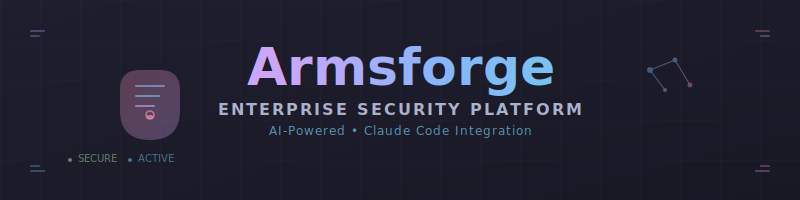

<p align="center">
  
</p>

<p align="center">
  <strong>Professional exploitation. Intelligent payloads. Zero detection footprint.</strong>
</p>

---

> **⚠️ Disclaimer**: This tool is designed for authorized red team engagements, penetration testing, and security research only. Users are responsible for ensuring compliance with all applicable laws and regulations. Use only in environments you own or have explicit written permission to test.

## Table of Contents

- [Features](#features)
- [Quick Start](#quick-start)
- [Usage](#usage)
- [MCP Tools Reference](#mcp-tools-reference)
- [Agent Reference](#agent-reference)
- [Architecture](#architecture)
- [Technology Stack](#technology-stack)
- [Security Considerations](#security-considerations)
- [Development](#development)
- [Contributing](#contributing)
- [License](#license)

## Features

Armsforge delivers comprehensive offensive security capabilities through Claude Code integration:

- **🥷 Exploit Development**: Buffer overflows, format strings, web exploits with automated shellcode generation
- **🚀 Payload Engineering**: Advanced evasion techniques, custom encoders, multi-stage delivery systems
- **🤖 Implant Development**: C2 frameworks, persistence modules, stealth communication channels
- **🔍 OPSEC Analysis**: Detection risk assessment, signature identification, evasion guidance
- **📚 OSCP/OSEP Preparation**: Structured methodologies, practice scenarios, exam-focused workflows
- **⚡ Claude Integration**: AI-powered code generation, automated testing, intelligent research assistance
- **🛡️ Template System**: 50+ exploit templates, 25+ reusable snippets, comprehensive coverage
- **🎯 MCP Tools**: Seamless Model Context Protocol integration for workflow automation

## Quick Start

### Prerequisites

| Requirement | Version | Purpose |
|-------------|---------|---------|
| **Node.js** | ≥20.0.0 | Runtime environment |
| **npm** | ≥9.0.0 | Package management |
| **Claude Code** | Latest | MCP integration |
| **Git** | Latest | Version control |

### Installation

**Option 1: Claude Code Plugin (Recommended)**
```
1. Open Claude Code plugin settings
2. Search for "Armsforge"
3. Click "Install"
```

**Option 2: Manual Installation (Development)**
```bash
git clone https://github.com/Real-Fruit-Snacks/armsforge.git
cd armsforge
npm install
npm run build
```

### Verification

**Test MCP Integration**
```
In Claude Code, use MCP tool:
af_list_templates
```

**Test Skill Integration**
```
In Claude Code, use skill commands:
/armsforge:exploit buffer-overflow
/armsforge:opsec-review
```

## Usage

### Template Retrieval

**List Available Templates**
```
In Claude Code, use MCP tools:
af_list_templates

With parameters:
af_list_templates category="exploit" language="python" arch="x64"
```

**Generate Exploit**
```
Buffer overflow exploit:
af_get_template name="bof-exploit" target_os="windows" target_arch="x64"

Web application exploit:
af_get_template name="sqli-exploit" format="python" evasion_level=2
```

### Snippet Integration

**Code Snippet Retrieval**
```
Process injection techniques:
af_get_snippet name="process-injection" language="csharp"

Encryption utilities:
af_get_snippet name="aes-decrypt" language="c"
```

### OPSEC Analysis

**Detection Risk Assessment**
```
Analyze suspicious API usage:
af_detection_lookup type="suspicious_api" pattern="VirtualAllocEx"

Check SIEM detection patterns:
af_detection_lookup type="sysmon" event_id="1"
```

## MCP Tools Reference

### Core Tools

| Tool | Purpose | Parameters | Output |
|------|---------|------------|--------|
| `af_list_templates` | Browse exploit templates | `category`, `language`, `arch` | Template catalog |
| `af_get_template` | Retrieve specific template | `name`, `target_os`, `evasion_level` | Customized exploit code |
| `af_list_snippets` | Browse code snippets | `language`, `technique` | Snippet catalog |
| `af_get_snippet` | Retrieve specific snippet | `name`, `language` | Reusable code block |
| `af_detection_lookup` | Analyze detection patterns | `type`, `pattern`, `event_id` | Detection intelligence |
| `af_template_info` | Get template metadata | `name` | Capability details |

### Advanced Parameters

| Parameter | Type | Values | Default | Description |
|-----------|------|--------|---------|-------------|
| `target_os` | string | `windows`, `linux`, `macos` | `windows` | Target operating system |
| `target_arch` | string | `x86`, `x64`, `arm64` | `x64` | Target architecture |
| `evasion_level` | integer | `1`, `2`, `3` | `1` | Sophistication level |
| `payload_format` | string | `exe`, `dll`, `shellcode`, `script` | `exe` | Output format |
| `language` | string | `c`, `cpp`, `csharp`, `python`, `rust` | `c` | Programming language |

## Agent Reference

### Specialized Agents

**Core Development Agents**
| Agent | Capability | Model | Focus |
|-------|------------|-------|-------|
| `exploit-dev` | Buffer overflows, format strings, web exploits | Sonnet | Vulnerability development |
| `payload-eng` | Shellcode, loaders, multi-stage payloads | Sonnet | Payload engineering |
| `implant-dev` | C2 frameworks, persistence, communication | Sonnet | Implant architecture |

**Analysis & Review Agents**
| Agent | Capability | Model | Focus |
|-------|------------|-------|-------|
| `opsec-reviewer` | Detection analysis, evasion guidance | Opus | Operational security |
| `finding-writer` | Report generation, documentation | Haiku | Technical writing |
| `privesc-analyst` | Privilege escalation research | Sonnet | Escalation techniques |

### Agent Invocation

**Skill-based Agent Usage (in Claude Code)**
```
Exploit development consultation:
/armsforge:exploit buffer-overflow --target windows --arch x64

OPSEC review:
/armsforge:opsec-review --code ./payload.c --target enterprise

Privilege escalation research:
/armsforge:privesc --os windows --method service
```

## Architecture

### Claude Code Integration

```
Claude Code CLI
├── MCP Server Bridge
│   ├── Tool Handlers (af_*)
│   ├── Template Engine
│   └── Context Validation
├── Agent Orchestration
│   ├── Specialized Agents
│   ├── Workflow Management
│   └── Result Synthesis
└── Content Management
    ├── Template Storage
    ├── Snippet Library
    └── Detection Database
```

### Data Flow

**Template Generation Pipeline**
1. **Request**: MCP tool invocation with parameters
2. **Validation**: Context validation via Zod schemas
3. **Selection**: Template matching based on criteria
4. **Customization**: Parameter injection and code generation
5. **OPSEC Review**: Detection risk analysis
6. **Delivery**: Formatted code output

**Agent Coordination**
1. **Routing**: Skill-based agent selection
2. **Context**: Shared memory and state management
3. **Execution**: Parallel processing where applicable
4. **Synthesis**: Result aggregation and presentation

## Technology Stack

### Core Technologies

| Component | Technology | Purpose |
|-----------|------------|---------|
| **Runtime** | Node.js 20+ | JavaScript execution |
| **Language** | TypeScript | Type-safe development |
| **Integration** | MCP SDK | Claude Code connectivity |
| **Validation** | Zod | Schema validation |
| **Templates** | Handlebars | Dynamic code generation |
| **Logging** | Winston | Structured logging |
| **Styling** | Chalk | Terminal output |

### Security Technologies

| Component | Implementation | Security Benefit |
|-----------|----------------|------------------|
| **Input Validation** | Zod schemas | Injection prevention |
| **Path Traversal Protection** | Custom validation | Filesystem security |
| **Template Sandboxing** | Handlebars SafeString | XSS prevention |
| **Error Handling** | Structured exceptions | Information disclosure prevention |
| **Audit Trail** | Winston logging | Security monitoring |

## Security Considerations

### OPSEC Guidelines

**Static Analysis Evasion**
- No hardcoded strings (C2 URLs, credentials, signatures)
- Obfuscated imports and API sequences
- String encryption for sensitive data
- Anti-analysis techniques

**Behavioral Evasion**
- Alternative API sequences vs. classic patterns
- Sleep/jitter to avoid rapid execution detection
- Memory management (RWX minimization)
- Parent process masquerading

**Network Evasion**
- Randomized user agents and headers
- Domain fronting support
- Beacon jitter implementation
- Legitimate traffic patterns

### Detection Database

**Coverage Areas**
- Suspicious Win32 APIs and detection patterns
- Sysmon event IDs for offensive techniques
- ETW providers logging malicious activity
- AMSI trigger patterns and bypass methods

## Development

### Build Process

**Development Workflow**
```bash
npm run dev        # Development with watch mode
npm run build      # Production build
npm test          # Test suite execution
npm run lint      # ESLint validation
npm run format    # Prettier formatting
```

**Security Validation**
```bash
npm run audit:security     # High-severity vulnerability scan
npm run audit:check        # Moderate-severity check
npm run test:coverage      # Security-focused coverage metrics
```

### Project Structure

```
armsforge/
├── src/                   # Source code
│   ├── agents/           # Specialized agents
│   ├── config/           # Configuration management
│   ├── mcp/              # MCP server implementation
│   ├── templates/        # Template engine
│   ├── theme/            # Catppuccin styling
│   └── utils/            # Utility functions
├── test/                 # Test suites
│   ├── integration/      # MCP integration tests
│   └── unit/            # Unit tests
├── data/                # Templates and snippets
│   ├── templates/       # Exploit templates
│   ├── snippets/        # Code snippets
│   └── detection/       # Detection patterns
├── docs/                # Documentation and website
└── bridge/              # CLI bridge
```

### Testing Strategy

**Security Test Coverage**
- Template injection prevention
- Path traversal protection
- Input validation completeness
- OPSEC guideline compliance
- Detection pattern accuracy

**Integration Testing**
- MCP tool functionality
- Agent coordination workflows
- Template generation pipelines
- Error handling robustness

## Contributing

### Development Guidelines

**Code Standards**
- TypeScript with strict mode enabled
- ESLint + Prettier for consistency
- Comprehensive JSDoc documentation
- Security-first design principles

**Security Review Process**
1. **OPSEC Analysis**: Detection risk assessment
2. **Code Review**: Security vulnerability scan
3. **Integration Testing**: MCP workflow validation
4. **Documentation**: Security implications noted

**Contribution Workflow**
1. Fork the repository
2. Create feature branch (`git checkout -b feature/amazing-feature`)
3. Commit changes (`git commit -m 'Add amazing feature'`)
4. Push to branch (`git push origin feature/amazing-feature`)
5. Open Pull Request with OPSEC analysis

### Issue Reporting

**Security Issues**
- Report via private disclosure to maintain OPSEC
- Include affected components and potential impact
- Provide reproduction steps for verification

**Feature Requests**
- Describe operational use case and benefits
- Consider OPSEC implications of proposed features
- Reference relevant security research or methodologies

## License

**MIT License** - see [LICENSE](LICENSE) file for details.

**Legal Notice**: This software is provided for authorized security testing, research, and educational purposes only. Users assume all responsibility for legal compliance and appropriate usage.

---

<p align="center">
  <strong>Armsforge - Forging the Future of Offensive Security</strong><br/>
  <em>Built for professional red teams and security researchers</em>
</p>